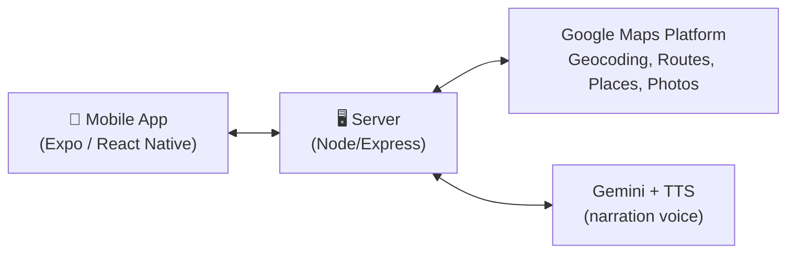

# Architecture

High-level overview of how the pieces talk to each other.

The mobile app only ever talks to our own server — it never calls Google or the AI services directly, so no API keys ship in the app.

- **Mobile app**: takes a start/end address, shows the route + landmarks/restaurants on a map, plays narration as you travel.
- **Server**: geocodes addresses, finds route options, scores them for scenic-ness, gathers landmarks/restaurants, and generates tour-guide narration (text + audio).
- **Google Maps Platform**: routes, places, and photos.
- **Gemini + TTS**: writes and voices the narration lines.

## Zooming in: the server's two pipelines

The server does two mostly-separate jobs behind two groups of endpoints.

```mermaid
graph TD
    subgraph "Route pipeline"
        A["POST /route<br/>{start, end}"] --> B[geocode both addresses]
        B --> C[fetch candidate routes]
        C --> D[sample points along each route<br/>+ search nearby landmarks/restaurants]
        D --> E[score each candidate]
        E --> F["return normal (fastest)<br/>+ scenic (best score)"]
    end

    subgraph "Narration pipeline"
        G["POST /narration(/pregenerate)<br/>{places}"] --> H[Gemini writes a short line<br/>per landmark/restaurant]
        H --> I[TTS turns it into an MP3]
        I --> J[cache text + audio on disk]
        J --> K["return {text, audioUrl}"]
    end
```

- **Route pipeline** answers "what's the route, and what's along it?" — a single request/response, done once when the user plans a trip.
- **Narration pipeline** answers "what should the tour guide say, out loud, at each stop?" — run once per trip (pregenerate), then the mobile app just plays cached audio files as it travels, keyed off live location.

## Zooming in further: request/response shapes

**`POST /route`** → `{ start, end, normal: {...}, scenic: {...}, extraTimeSeconds }`
Each of `normal`/`scenic` carries `{ polyline, distanceMeters, durationSeconds, landmarks[], foodStops[] }`. Only landmarks affect which route is picked "scenic" — restaurants are suggestions, not scoring inputs.

**`GET /photo?name=...`** → proxies Google's Places Photo Media endpoint and streams image bytes back, so the Maps API key never has to appear in a URL the app holds directly.

**`POST /narration`** / **`POST /narration/pregenerate`** → `{ placeId, text, audioUrl, durationHintS }` (or an array of those, in the same order as the request). `audioUrl` is a path like `/audio/<file>.mp3`, served off the server's disk cache — same place + same voice settings always resolves to the same file, so repeat calls are free. Full contract in [`docs/narration-api.md`](./narration-api.md).

**No keys in the client**: every box in the diagrams above that touches Google/Gemini/TTS lives in `server/` — the mobile app only ever calls our own four endpoints.
