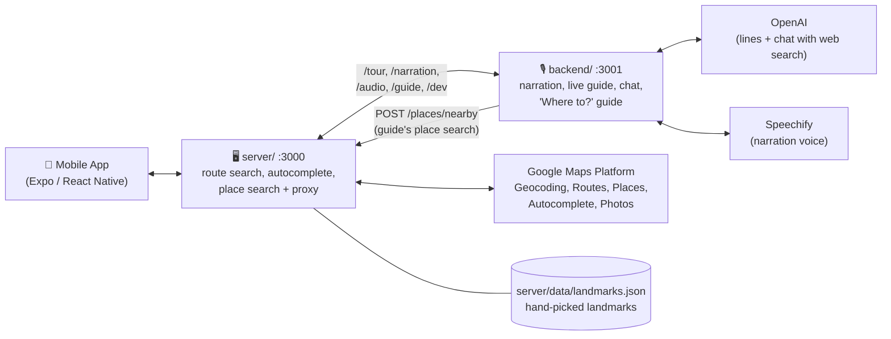

# Architecture

High-level overview of how the pieces talk to each other.

The mobile app only ever talks to `server/`, its single base URL. It never calls Google, OpenAI or Speechify directly, so no API keys ship in the app.

- **Mobile app**: takes a start/end address (with autocomplete) or helps the user pick a destination through the "Where to?" guide chat, shows the route + landmarks/restaurants on a map with a 3D fly-through preview, plays narration as you travel.
- **`server/`**: geocodes addresses, suggests addresses as you type, finds route options (including detours through hand-picked landmarks), scores them for scenic-ness, gathers landmarks/restaurants, and forwards everything narration- and guide-related to `backend/` (streamed, same status codes and headers; `502 backend_unavailable` if the backend is down). It also serves `POST /places/nearby`, the place search the "Where to?" guide uses.
- **`backend/`**: writes and voices tour-guide narration, runs the live guide, the chat agent and the "Where to?" guide, and serves the cached audio. Internal: only `server/` calls it. The one call it makes back is to `server/`'s `/places/nearby` (`SERVER_URL`), because the Google key lives only in `server/`.
- **Google Maps Platform**: geocoding, routes, places (nearby and text search), autocomplete, and photos.
- **OpenAI**: writes the narration lines (`gpt-4.1-nano`) and answers chat with web search (`gpt-4o-mini`).
- **Speechify**: turns each line into an MP3.

## Zooming in: the four pipelines

```mermaid
graph TD
    subgraph "Route pipeline (server/)"
        A["POST /route<br/>{start, end, maxExtraMinutes?}"] --> B[geocode both addresses]
        B --> C[fetch Google's candidate routes]
        C --> C2[add detour candidates through<br/>hand-picked landmarks the fastest route misses]
        C2 --> D[sample points along each route<br/>+ search nearby landmarks;<br/>restaurants only in the last mile]
        D --> D2[filter: visible from the road,<br/>outdoor types, rating 4.3+ with 100+ reviews]
        D2 --> E[score candidates within the<br/>extra-time budget]
        E --> F["return normal (fastest)<br/>+ scenic (best score)"]
    end

    subgraph "'Where to?' guide (backend/ + server/)"
        S["POST /guide/destination<br/>{conversationId?, message | choice, lat, lng}"] --> T[understand the tap or typed text<br/>keyword interpreter]
        T --> U{stage}
        U -->|intent / category| V[reply + chips<br/>hungry or sightseeing, then cuisine or kind]
        U -->|results| W["server/ POST /places/nearby<br/>nearest good places"]
        W --> X[reply + place cards]
        U -->|confirmed| Y["return destination<br/>app fills in the trip"]
    end

    subgraph "Pregenerated narration (backend/)"
        G["POST /narration/pregenerate<br/>{places}"] --> H[OpenAI writes a short line<br/>per landmark/restaurant]
        H --> I[Speechify turns it into an MP3]
        I --> J[cache text + audio on disk]
        J --> K["return [{text, audioUrl}]"]
    end

    subgraph "Live guide (backend/)"
        L["POST /tour/tick<br/>{lat, lng, heading, speed}"] --> M[is the car approaching a place?]
        M -->|yes| N[write + voice the line in the background<br/>same cache as above]
        N --> O["later tick returns {narration}"]
        P["POST /tour/chat<br/>{message}"] --> Q[OpenAI + web search,<br/>with the ride as context]
        Q --> R["return {reply, sources}"]
    end
```

- **Route pipeline** answers "what's the route, and what's along it?" — one request when the user plans a trip. The scenic route may cost at most 5 minutes plus 20% of the fastest route, or the app's "max extra time" setting (`maxExtraMinutes`). Hand-picked landmarks count double in the score and nature stops 1.5x; restaurants never affect the choice and are suggested only near the destination, ranked partly by how visible they are from the final approach. Tunables are in `server/src/config.ts`.
- **"Where to?" guide** answers "where should I go?" before a trip exists. The backend owns the whole conversation (stages `intent` → `category` → `results` → `confirmed`, the reply text, chips and place cards); the app just renders it and sends taps or typed text along with the phone's position. Conversations live in memory for 30 minutes. When the user picks a place, the app sets it as the destination with the current location as the start and runs the route pipeline.
- **Pregenerated narration** is what the app's tour mode uses today: the app asks for places a few at a time as they come within 2 km (nearest first, plus the ones near the start while the route preview is open), then decides on the phone when to play each clip as it travels.
- **Live guide** is the server-driven alternative: the app sends GPS ticks and the server decides when to narrate, generates the line right then, and drops it if the car has already passed. It adds the chat agent. Both narration paths share one disk cache, so a place's audio is generated once.

## Zooming in further: request/response shapes

**`POST /route`** → `{ start, end, normal: {...}, scenic: {...}, extraTimeSeconds }`
Each of `normal`/`scenic` carries `{ polyline, distanceMeters, durationSeconds, landmarks[], foodStops[] }`. Only landmarks affect which route is picked "scenic" — restaurants are suggestions, not scoring inputs.

**`GET /autocomplete?input=...&sessionToken=...`** → `{ suggestions: [{ placeId, text, mainText, secondaryText }] }`, a Places Autocomplete proxy; a suggestion's `text` goes straight into `/route`.

**`GET /photo?name=...`** → proxies Google's Places Photo Media endpoint and streams image bytes back, so the Maps API key never has to appear in a URL the app holds directly.

**`POST /narration/pregenerate`** / **`POST /narration`** → `[{ placeId, text, audioUrl, durationHintS }]` (same order as the request) or one of those. `audioUrl` is a path like `/audio/<file>.mp3`, served from the backend's disk cache through `server/` — same place, model and voice settings always resolve to the same file, so repeat calls are free.

**`POST /tour/start|tick|chat|end`** → the live guide; `tick` returns `{ narration | null, pending }`, `chat` returns `{ reply, placeId, sources }`.

**`POST /guide/destination`** → `{ conversationId, stage, reply, chips[], places[], destination | null }` on every call; `places` is filled only in `results`, `destination` only in `confirmed`.

**`POST /places/nearby`** (internal, called by the guide) → `{ places: PlaceCard[] }` from `{ lat, lng, types?, query?, radiusMeters?, limit?, minRating?, requireOpen?, sortBy? }`.

Full contracts, errors and the app flow: [`docs/api.md`](./api.md); the guide in detail: [`docs/destination-guide-api.md`](./destination-guide-api.md).
