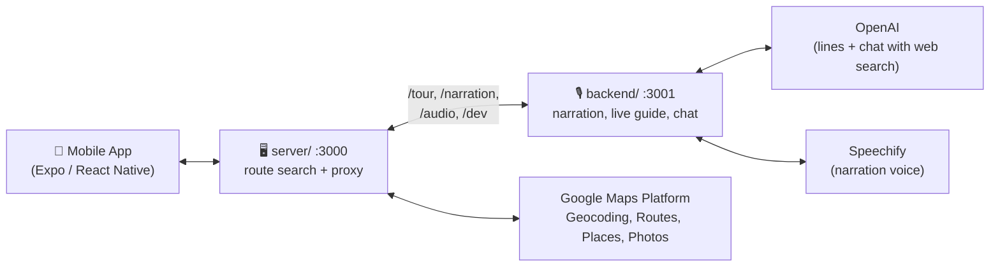

# Architecture

High-level overview of how the pieces talk to each other.

The mobile app only ever talks to `server/`, its single base URL. It never calls Google, OpenAI or Speechify directly, so no API keys ship in the app.

- **Mobile app**: takes a start/end address, shows the route + landmarks/restaurants on a map, plays narration as you travel.
- **`server/`**: geocodes addresses, finds route options, scores them for scenic-ness, gathers landmarks/restaurants, and forwards everything narration-related to `backend/` (streamed, same status codes and headers; `502 backend_unavailable` if the backend is down).
- **`backend/`**: writes and voices tour-guide narration, runs the live guide and the chat agent, and serves the cached audio. Internal: only `server/` calls it.
- **Google Maps Platform**: routes, places, and photos.
- **OpenAI**: writes the narration lines (`gpt-4.1-nano`) and answers chat with web search (`gpt-4o-mini`).
- **Speechify**: turns each line into an MP3.

## Zooming in: the three pipelines

```mermaid
graph TD
    subgraph "Route pipeline (server/)"
        A["POST /route<br/>{start, end}"] --> B[geocode both addresses]
        B --> C[fetch candidate routes]
        C --> D[sample points along each route<br/>+ search nearby landmarks/restaurants]
        D --> E[score each candidate]
        E --> F["return normal (fastest)<br/>+ scenic (best score)"]
    end

    subgraph "Pregenerated narration (backend/)"
        G["POST /narration/pregenerate<br/>{places}"] --> H[OpenAI writes a short line<br/>per landmark/restaurant]
        H --> I[Speechify turns it into an MP3]
        I --> J[cache text + audio on disk]
        J --> K["return [{text, audioUrl}]"]
    end

    subgraph "Live guide (backend/)"
        L["POST /tour/tick<br/>{lat, lng, heading, speed}"] --> M[is the car approaching a place?]
        M -->|yes| N[write + voice the line in the background<br/>same cache as above]
        N --> O["later tick returns {narration}"]
        P["POST /tour/chat<br/>{message}"] --> Q[OpenAI + web search,<br/>with the ride as context]
        Q --> R["return {reply, sources}"]
    end
```

- **Route pipeline** answers "what's the route, and what's along it?" — one request when the user plans a trip.
- **Pregenerated narration** is what the app's tour mode uses today: the app asks for places a few at a time as they come within 2 km (nearest first, plus the ones near the start while the route preview is open), then decides on the phone when to play each clip as it travels.
- **Live guide** is the server-driven alternative: the app sends GPS ticks and the server decides when to narrate, generates the line right then, and drops it if the car has already passed. It adds the chat agent. Both narration paths share one disk cache, so a place's audio is generated once.

## Zooming in further: request/response shapes

**`POST /route`** → `{ start, end, normal: {...}, scenic: {...}, extraTimeSeconds }`
Each of `normal`/`scenic` carries `{ polyline, distanceMeters, durationSeconds, landmarks[], foodStops[] }`. Only landmarks affect which route is picked "scenic" — restaurants are suggestions, not scoring inputs.

**`GET /photo?name=...`** → proxies Google's Places Photo Media endpoint and streams image bytes back, so the Maps API key never has to appear in a URL the app holds directly.

**`POST /narration/pregenerate`** / **`POST /narration`** → `[{ placeId, text, audioUrl, durationHintS }]` (same order as the request) or one of those. `audioUrl` is a path like `/audio/<file>.mp3`, served from the backend's disk cache through `server/` — same place, model and voice settings always resolve to the same file, so repeat calls are free.

**`POST /tour/start|tick|chat|end`** → the live guide; `tick` returns `{ narration | null, pending }`, `chat` returns `{ reply, placeId, sources }`.

Full contracts, errors and the app flow: [`docs/api.md`](./api.md).
